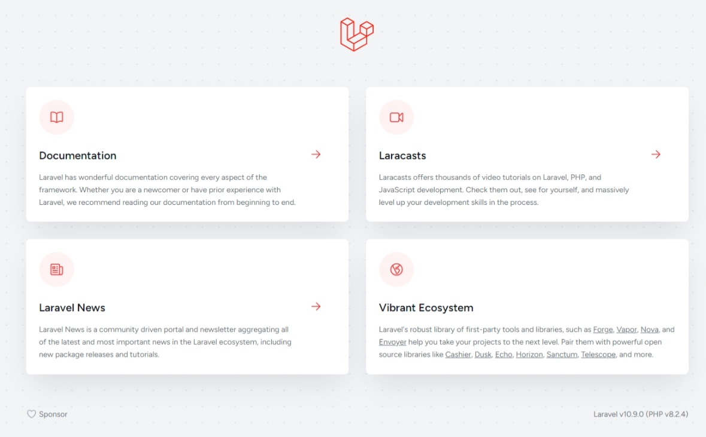
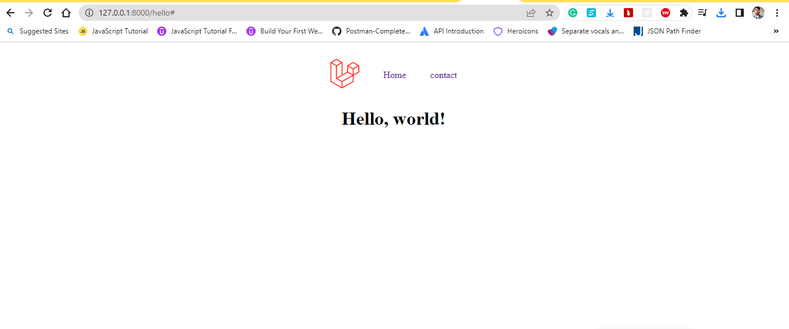

    

## To install Composer, you can follow these steps:

1. Download Composer:

-   Visit the official Composer website at https://getcomposer.org/download/.

2. Windows:
   Download the Composer setup executable (`Composer-Setup.exe`) from the official website.

-   run the installer.
-   Follow the instructions in the setup wizard to complete the installation.

3. Verify the Installation:

-   To verify that Composer is installed correctly, Run the following command:
    Composer --version
    In a new terminal or command prompt.
-   If Composer is installed properly, it will show the version number of composer.
    That's it!

## To install Laravel follow these steps:

1. Prerequisites:
   Check by running `php --version` in a command line.
   Ensure you have Composer installed, Composer --version in a command line.
2. Install Laravel:
   Run the following command to install Laravel globally on your system:
   composer global require laravel/installer
3. Create a New Laravel Project:
   Navigate to the directory where to create a Laravel project.
   Run the following command to create a new Laravel project:
   laravel new myApp
4. Serve the Application:
   cd myApp
   php artisan serve
   This will start the server at `http://localhost:8000`.

## For making controller

php artisan make:controller helloController

## In terminal for git

-git init
-git add .
-git commit -m "first-commit"
-git branch -M master
-git remote add origin https://github.com/shashidas95/myApp.git
-git push -u origin master

## The purpose of each of the following folders in a typical Laravel project:

1. app: The `app` folder is where most of the application's business logic resides. It contains the core components of the Laravel application, such as models, controllers, middleware, service providers, and other classes related to the application's functionality.

2. bootstrap: The `bootstrap` folder contains the files that are responsible for bootstrapping the Laravel framework. It includes important files like `app.php`, which sets up the application environment and loads necessary dependencies.

3. config: The `config` folder contains configuration files for various aspects of the Laravel application. These files define settings related to the database connections, mail services, cache configurations, application environment, and other application-specific settings.

4. database: The `database` folder is where you define database-related files and configurations. It includes migration files that define the structure of database tables, seed files for populating the database with initial data, and factories for generating test data. The folder may also contain SQLite databases used for testing.

5. public: The `public` folder is the web server's document root for the Laravel application. It contains the front controller `index.php`, which serves as the entry point for all requests. The folder also holds assets such as CSS, JavaScript, and image files that can be accessed directly by the client.

6. resources: The `resources` folder contains the views, language files, and other resource files used by the application. The `views` subfolder holds the blade templates that define the HTML structure and UI of the application. Other subfolders within `resources` may contain language files, assets like CSS and JavaScript files, and raw assets like images or fonts.

7. routes: The `routes` folder contains route definitions for the application. It includes `web.php` for web-based routes and `api.php` for API routes. Routes define the endpoints of the application and map them to appropriate controllers or closures for handling requests.

8. storage: The `storage` folder is used for storing various files generated by the application. It includes subfolders like `app`, `framework`, `logs`, and `public` for storing application-specific files, cached files, logs, and publicly accessible files like user-generated uploads, respectively.

9. tests: The `tests` folder contains test files for automated testing of the application. It includes unit tests and feature tests that help ensure the correctness and reliability of the application's codebase. Tests can be written using Laravel's testing framework or any other preferred testing tools.

10. vendor: The `vendor` folder is not included in the initial project structure. It is created and populated when you install the application's dependencies using Composer. The `vendor` folder contains all the dependencies specified in the `composer.json` file, including Laravel itself and any additional packages or libraries used in the project.

-   [Simple, fast routing engine](https://laravel.com/docs/routing).
-   [Powerful dependency injection container](https://laravel.com/docs/container).
-   Multiple back-ends for [session](https://laravel.com/docs/session) and [cache](https://laravel.com/docs/cache) storage.
-   Expressive, intuitive [database ORM](https://laravel.com/docs/eloquent).
-   Database agnostic [schema migrations](https://laravel.com/docs/migrations).
-   [Robust background job processing](https://laravel.com/docs/queues).
-   [Real-time event broadcasting](https://laravel.com/docs/broadcasting).

Laravel is accessible, powerful, and provides tools required for large, robust applications.

## Learning Laravel

Laravel has the most extensive and thorough [documentation](https://laravel.com/docs) and video tutorial library of all modern web application frameworks, making it a breeze to get started with the framework.

You may also try the [Laravel Bootcamp](https://bootcamp.laravel.com), where you will be guided through building a modern Laravel application from scratch.

If you don't feel like reading, [Laracasts](https://laracasts.com) can help. Laracasts contains over 2000 video tutorials on a range of topics including Laravel, modern PHP, unit testing, and JavaScript. Boost your skills by digging into our comprehensive video library.

## Laravel Sponsors

We would like to extend our thanks to the following sponsors for funding Laravel development. If you are interested in becoming a sponsor, please visit the Laravel [Patreon page](https://patreon.com/taylorotwell).

### Premium Partners

-   **[Vehikl](https://vehikl.com/)**
-   **[Tighten Co.](https://tighten.co)**
-   **[Kirschbaum Development Group](https://kirschbaumdevelopment.com)**
-   **[64 Robots](https://64robots.com)**
-   **[Cubet Techno Labs](https://cubettech.com)**
-   **[Cyber-Duck](https://cyber-duck.co.uk)**
-   **[Many](https://www.many.co.uk)**
-   **[Webdock, Fast VPS Hosting](https://www.webdock.io/en)**
-   **[DevSquad](https://devsquad.com)**
-   **[Curotec](https://www.curotec.com/services/technologies/laravel/)**
-   **[OP.GG](https://op.gg)**
-   **[WebReinvent](https://webreinvent.com/?utm_source=laravel&utm_medium=github&utm_campaign=patreon-sponsors)**
-   **[Lendio](https://lendio.com)**

## Contributing

Thank you for considering contributing to the Laravel framework! The contribution guide can be found in the [Laravel documentation](https://laravel.com/docs/contributions).

## Code of Conduct

In order to ensure that the Laravel community is welcoming to all, please review and abide by the [Code of Conduct](https://laravel.com/docs/contributions#code-of-conduct).

## Security Vulnerabilities

If you discover a security vulnerability within Laravel, please send an e-mail to Taylor Otwell via [taylor@laravel.com](mailto:taylor@laravel.com). All security vulnerabilities will be promptly addressed.

## License

The Laravel framework is open-sourced software licensed under the [MIT license](https://opensource.org/licenses/MIT).
