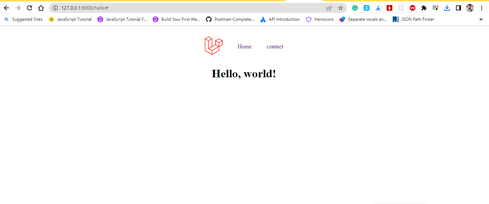

## To install Composer, you can follow these steps:

1. Download Composer:

-   Visit the official Composer website at https://getcomposer.org/download/.

2. Windows:
   Download the Composer setup executable (`Composer-Setup.exe`) from the official website.

-   run the installer.
-   Follow the instructions in the setup wizard to complete the installation.

3. Verify the Installation:

-   To verify that Composer is installed correctly, Run the following command:
    Composer --version
    In a new terminal or command prompt.
-   If Composer is installed properly, it will show the version number of composer.
    That's it!

## To install Laravel follow these steps:

1. Prerequisites:
   - Check by running `php --version` in a command line.
   - Ensure you have Composer installed, Composer --version in a command line.
2. Install Laravel:
   - Run the following command to install Laravel globally on your system:
   - composer global require laravel/installer
3. Create a New Laravel Project:
   - Navigate to the directory where to create a Laravel project.
   - Run the following command to create a new Laravel project:
   - laravel new myApp
4. Serve the Application:
   - cd myApp
   - php artisan serve
   This will start the server at `http://localhost:8000`.
   
   
   
## In web.php
- Route::get('/hello', [helloController::class, 'index']);
## For making controller
- php artisan make:controller helloController
## in index method of helloController
- public function index() {return view('hello'); }
## in hello.blade.php  view
-   <h1>Hello, world!</h1>
## In terminal for git

- git init
- git add .
- git commit -m "first-commit"
- git branch -M master
- git remote add origin https://github.com/shashidas95/myApp.git
- git push -u origin master

## The purpose of each of the following folders in a typical Laravel project:

1. app: The `app` folder is where most of the application's business logic resides. It contains the core components of the Laravel application, such as models, controllers, middleware, service providers, and other classes related to the application's functionality.

2. bootstrap: The `bootstrap` folder contains the files that are responsible for bootstrapping the Laravel framework. It includes important files like `app.php`, which sets up the application environment and loads necessary dependencies.

3. config: The `config` folder contains configuration files for various aspects of the Laravel application. These files define settings related to the database connections, mail services, cache configurations, application environment, and other application-specific settings.

4. database: The `database` folder is where you define database-related files and configurations. It includes migration files that define the structure of database tables, seed files for populating the database with initial data, and factories for generating test data. The folder may also contain SQLite databases used for testing.

5. public: The `public` folder is the web server's document root for the Laravel application. It contains the front controller `index.php`, which serves as the entry point for all requests. The folder also holds assets such as CSS, JavaScript, and image files that can be accessed directly by the client.

6. resources: The `resources` folder contains the views, language files, and other resource files used by the application. The `views` subfolder holds the blade templates that define the HTML structure and UI of the application. Other subfolders within `resources` may contain language files, assets like CSS and JavaScript files, and raw assets like images or fonts.

7. routes: The `routes` folder contains route definitions for the application. It includes `web.php` for web-based routes and `api.php` for API routes. Routes define the endpoints of the application and map them to appropriate controllers or closures for handling requests.

8. storage: The `storage` folder is used for storing various files generated by the application. It includes subfolders like `app`, `framework`, `logs`, and `public` for storing application-specific files, cached files, logs, and publicly accessible files like user-generated uploads, respectively.

9. tests: The `tests` folder contains test files for automated testing of the application. It includes unit tests and feature tests that help ensure the correctness and reliability of the application's codebase. Tests can be written using Laravel's testing framework or any other preferred testing tools.

10. vendor: The `vendor` folder is not included in the initial project structure. It is created and populated when you install the application's dependencies using Composer. The `vendor` folder contains all the dependencies specified in the `composer.json` file, including Laravel itself and any additional packages or libraries used in the project.

## .env file 

Regarding the ".env" file in Laravel, it is a configuration file that stores environment-specific settings for your application. It contains key-value pairs defining various settings such as database connection details, caching configuration, application URL, and more.

Here's how you can configure the ".env" file in Laravel:

Locate the ".env" file in the root directory of your Laravel project.

Open the ".env" file in a text editor.

Update the values of the key-value pairs according to your desired configuration. For example, you might update the database connection settings:
DB_CONNECTION=mysql
DB_HOST=127.0.0.1
DB_PORT=3306
DB_DATABASE=mydatabase
DB_USERNAME=myuser
DB_PASSWORD=mypassword
You can modify other settings in a similar way, depending on your project requirements.

Save the changes to the ".env" file.
The ".env" file is designed to store sensitive information like database credentials, API keys, etc. It's important to keep this file secure and avoid committing it to version control systems like Git. Instead, you can commit a ".env.example" file that contains default configuration values, and each developer or deployment environment can create their own ".env" file based on that example, setting their specific configuration values.

Note that after modifying the ".env" file, you may need to clear the application cache using the php artisan cache:clear command for the changes to take effect.

## The `composer.json` file is a crucial component in PHP projects that use Composer, a dependency management tool. It serves the following purposes:

1. Dependency Management: The `composer.json` file defines the dependencies required by the project. It lists the external libraries, frameworks, and packages that the project relies on. Composer uses this file to download and install the specified dependencies, ensuring that the project has access to the required code.

2. Autoloading: The `composer.json` file specifies the autoloading rules for the project. It defines the mapping between namespaces and the corresponding directory structure, allowing you to use class autoloading effortlessly. Composer generates the autoloader code based on this configuration, simplifying the inclusion of class files.

3. Project Configuration: The `composer.json` file can include various project-level configuration options. For example, it can define scripts that are executed during the Composer lifecycle, specify repositories for fetching packages, set minimum PHP version requirements, and more. This file provides a centralized location to configure various aspects of the project.

4. Version Constraints: Within the `composer.json` file, you can specify version constraints for the dependencies. This allows you to define the acceptable versions or version ranges for each dependency, ensuring that your project uses compatible packages. Version constraints provide flexibility in managing upgrades and maintaining compatibility.

By defining dependencies, autoloading rules, project configuration, and version constraints in the `composer.json` file, Composer simplifies the management of PHP projects, promotes code reuse, and streamlines the integration of third-party libraries and packages.

## A framework

is a software infrastructure that provides a structured and reusable foundation for developing applications. It typically consists of libraries, tools, and components that assist in building and organizing software applications. Frameworks aim to simplify development by offering pre-defined structures, conventions, and functionality that developers can leverage, reducing the need to build everything from scratch.

Here are some key aspects and benefits of using a framework:

Abstraction: Frameworks abstract common functionalities and operations, providing higher-level abstractions that enable developers to focus on implementing application-specific logic rather than dealing with low-level details. This abstraction promotes code reuse and standardization across projects.

Structure and Organization: Frameworks often provide a predefined structure and architecture for organizing code, files, and directories. This ensures consistency and clarity in the project's layout, making it easier for developers to navigate, maintain, and collaborate on the codebase.

Reusability: Frameworks offer reusable components, libraries, and modules that can be easily integrated into applications. This reusability speeds up development by allowing developers to leverage existing solutions instead of reinventing the wheel. It encourages code modularity and fosters a more efficient and maintainable codebase.

Convention over Configuration: Frameworks often follow a set of conventions and guidelines, making assumptions about how applications should be structured and behave. This convention-over-configuration approach reduces the need for explicit configuration and decision-making, resulting in faster development cycles and improved code consistency.

Standardized Tools and Practices: Frameworks typically provide a set of tools, utilities, and practices that streamline common development tasks, such as database access, input validation, session management, and routing. These tools promote best practices, enhance productivity, and help ensure the security and reliability of applications.

Community and Ecosystem: Frameworks often have active communities of developers and maintainers. This community support brings benefits such as documentation, tutorials, forums, and third-party packages or extensions that extend the framework's capabilities. It creates a collaborative environment and a wealth of resources for developers to tap into.

Common examples of popular frameworks include Laravel and Symfony for PHP, Django and Flask for Python, Ruby on Rails for Ruby, and Angular and React for JavaScript. These frameworks offer a structured approach to building web applications, providing a set of tools, libraries, and conventions to facilitate development.

## package manager?

A package manager is a software tool that simplifies the process of installing, managing, and updating software packages or libraries within a software development ecosystem. It automates the handling of dependencies, ensuring that all required components are installed correctly and that the versions are compatible with each other.

Here are some key aspects and benefits of using a package manager:

Dependency Management: Package managers handle dependencies by resolving and installing the necessary components for a software project. They ensure that all required libraries, frameworks, and tools are installed in the correct versions, saving developers from manually managing dependencies.

Package Installation and Removal: Package managers provide a simple and consistent way to install and remove software packages. They handle the entire process, including downloading packages from repositories, extracting and installing them, and managing any configuration steps required. This streamlines the setup process for developers.

Versioning and Compatibility: Package managers maintain versioning information for packages, enabling developers to specify version constraints and ensuring compatibility between different components of a project. They can automatically update packages to newer versions while respecting the specified version constraints.

Repository Management: Package managers typically interact with package repositories or registries that host a collection of software packages. These repositories serve as centralized sources where packages are stored, versioned, and made available for installation. Package managers handle repository management tasks, such as querying and fetching packages, as well as providing mechanisms for package discovery.

Simplified Deployment: Package managers ease the deployment process by providing a streamlined way to package applications and their dependencies. They allow developers to define the project's requirements, and the package manager can package everything into a single distribution format, making it easier to distribute and install the application on different systems.

Community and Ecosystem: Package managers often foster active communities and ecosystems around specific programming languages or platforms. These communities contribute to the development, maintenance, and sharing of packages, expanding the available options for developers and providing resources, documentation, and support.

Common examples of package managers include Composer for PHP, npm for Node.js, pip for Python, Maven for Java, and apt-get or yum for Linux distributions. These package managers greatly simplify the installation and management of software components, promote code reuse, and contribute to the efficiency and productivity of software development.

## What is a dependency?

In the context of software development, a dependency refers to the reliance of one software component on another. It occurs when one piece of code or module requires the presence and functionality of another module, library, or package in order to function correctly.

Dependencies can exist at various levels within a software project, including:

Library or Package Dependencies: These dependencies occur when a software component relies on external libraries or packages to provide additional functionality. For example, a web application might depend on a specific framework or library for handling HTTP requests, database access, or user authentication.

Module or Component Dependencies: Dependencies can also exist between different modules or components within a software system. A module may depend on the functions, classes, or interfaces provided by another module to accomplish a specific task. These dependencies define the relationships and interactions between different parts of the system.

Build or Tooling Dependencies: Dependencies can extend beyond code and libraries to include tools or build systems necessary for development, testing, or deployment. Examples of such dependencies include compilers, development frameworks, package managers, or continuous integration tools.

Managing dependencies is crucial for the successful development and maintenance of software projects. Dependency management tools and practices help ensure that the correct versions of required components are installed, handle conflicts between different dependencies, and simplify the process of updating or adding new dependencies.

Package managers, as mentioned earlier, are commonly used to manage software dependencies by automating the installation, versioning, and resolution of packages. They help maintain consistency, simplify the deployment process, and promote code reuse by handling the complexities of dependency management.

## What is a package?

In software development, a package refers to a collection of related files, modules, libraries, or resources that are bundled together for easy distribution, installation, and reuse. Packages serve as units of software that encapsulate functionality, making it convenient to share and integrate code across projects.

Here are some key characteristics and benefits of packages:

Code Organization: Packages help organize code by grouping related files and modules together. This modular structure improves code readability, maintainability, and scalability by providing a clear and logical organization of functionality.

Reusability: Packages promote code reuse by encapsulating specific functionality or features that can be easily integrated into different projects. Instead of rewriting code from scratch, developers can leverage existing packages to save time and effort.

Encapsulation and Abstraction: Packages provide encapsulation, which means they hide the implementation details of their internal code, exposing only the necessary interfaces or APIs. This abstraction layer allows other developers to use the package's functionality without needing to understand its internal workings.

Versioning: Packages are often versioned to keep track of changes and ensure compatibility. Version numbers allow developers to manage dependencies effectively, specify version constraints, and handle upgrades or rollbacks.

Distribution and Installation: Packages are distributed as standalone units that can be easily shared and installed in different environments. They typically include all the necessary files, dependencies, and metadata required for proper installation and use.

Documentation and Support: Well-designed packages often come with documentation, examples, and support resources that assist developers in understanding and effectively utilizing the provided functionality. This promotes usability and reduces the learning curve when integrating packages into projects.

Packages are commonly managed and distributed through package managers, which handle the downloading, installation, and updating of packages from repositories. By leveraging packages and package managers, developers can simplify the integration of external code, enhance code organization, encourage code reuse, and improve overall productivity in software development.

##  route in Laravel?

In the context of the Laravel PHP framework, a route is a mechanism that maps URLs (Uniform Resource Locators) to specific actions or handlers within your application. It defines the endpoints or entry points for incoming HTTP requests and determines how those requests should be handled.

Routes in Laravel provide a way to define the URI pattern and associate it with a callback function or controller method that executes the desired logic. This allows you to define the behavior of your application for different routes or URLs.

Here are some key aspects of routes in Laravel:

URI Pattern: A route in Laravel is associated with a specific URI pattern or URL. The URI pattern can include placeholders or route parameters that capture dynamic parts of the URL. For example, /users/{id} is a route with a parameter {id} that can match various user IDs.

HTTP Verbs: Routes can be defined for different HTTP verbs such as GET, POST, PUT, PATCH, and DELETE. This allows you to handle different types of requests on the same URL but with different actions.

Callback Functions or Controllers: Routes can be associated with callback functions or controller methods that are executed when the corresponding route is accessed. The callback function or controller method defines the logic to be executed, such as retrieving data, processing forms, or rendering views.

Named Routes: Laravel allows you to assign names to routes, making it easier to reference them in your application. Named routes provide a convenient way to generate URLs or perform route-related tasks programmatically.

Route Groups and Middleware: Laravel allows you to group routes based on common characteristics, such as sharing middleware or applying route prefixing. Route groups provide a way to organize routes and apply shared functionality to multiple routes at once.

By defining routes in Laravel, you can establish the URLs and corresponding actions or handlers for your application. This enables you to define the API endpoints, web pages, and RESTful resources that your application exposes, allowing for a structured and controlled way of handling incoming requests and providing responses.

##  a web server?

A web server is a software application that serves as the backbone of the World Wide Web, enabling the delivery of web pages and other resources over the internet. It responds to incoming requests from web browsers or client applications, processes those requests, and sends back the requested data.

Here are some key aspects and functionalities of a web server:

Handling HTTP Requests: Web servers primarily handle Hypertext Transfer Protocol (HTTP) requests. They receive requests from clients (web browsers or other client applications) over the internet and process them accordingly. This includes parsing the request, interpreting the requested resource, and generating an appropriate response.

Hosting Web Pages and Resources: Web servers store and serve web pages, images, CSS stylesheets, JavaScript files, and other resources that make up a website or web application. They handle requests for these resources and send them back to the client for display or processing.

Serving Static and Dynamic Content: Web servers can handle both static content and dynamic content generation. Static content includes files that remain the same and are served as-is, such as HTML files or image files. Dynamic content is generated on the fly based on user input, database queries, or other computations, such as generating personalized web pages or processing form submissions.

Content Delivery and Load Balancing: Web servers can be configured to distribute incoming requests across multiple servers or instances to balance the load and improve performance. Load balancing ensures that requests are distributed evenly, optimizing resource utilization and providing better scalability for high-traffic websites.

Security and Authentication: Web servers often include security features such as encryption (e.g., HTTPS), authentication mechanisms, and access control to protect sensitive data and restrict unauthorized access. They can enforce secure communication protocols and validate user credentials before granting access to protected resources.

Logging and Monitoring: Web servers generate logs that record various events, such as incoming requests, errors, and access statistics. These logs provide valuable information for troubleshooting, performance monitoring, and security analysis.

Common web server software includes Apache HTTP Server, Nginx, Microsoft Internet Information Services (IIS), and LiteSpeed. These web servers handle the communication between clients and web applications, facilitating the retrieval and delivery of web content over the internet.

Regenerate response

Regenerate response
